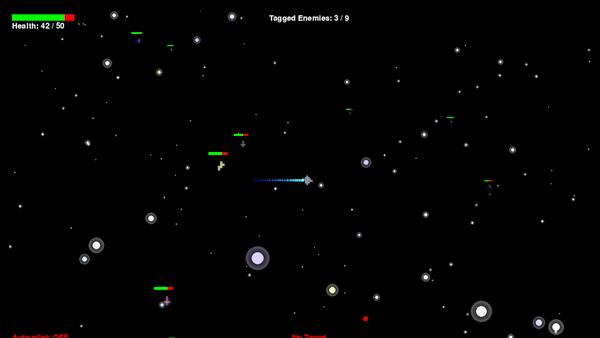

# Pulse Vector


## About
Write soemthing here.
## Requirements
### Platforms
We have tested this on the following platforms:
- Linux Mint
### Python Packages
```
pygame==2.6.1
pytest==8.3.4
```
(see requirements.txt)

## Installation
1. Open a Terminal.
2. Change directories (`cd`/`pushd`) to the desired project folder. 
3. Clone the repository located at https://github.com/deviousname/pulsevectoralpha. (e.g. `git clone "git@github.com:deviousname/pulsevectoralpha.git"`)
4. Run `cd ./pulsevectoralpha/` to enter the project folder.

## Setup
### Virtual Envirnoment 
This is a suggested way to create a virtual environment. There are many tools people prefer for this, and feel free to use another one of your preference, or to use the tools outlined in the following example in a different way. 

1. Open a Terminal and `cd` to your repository folder (`cd ./pulsevectoralpha`)
2. Run `python3 -m venv .` to create the virtual environment in this folder.
3. Run `source ./bin/activate` to enter the virtual environnment.
4. Run `pip install -r requirements.txt` to install the dependencies.

## Usage
### 🎮 **Controls**
| **Key**         | **Action**                            |
|-----------------|---------------------------------------|
| `W`             | Move Up                              |
| `A`             | Move Left                            |
| `S`             | Move Down                            |
| `D`             | Move Right                           |
| `TAB`           | Cycle Lock-On Target (Shift + TAB to cycle backward) |
| `F`             | Toggle Auto-Follow on Tagged Enemy   |
| `R`             | Activate "King of the Hill" Racing Mode |
| `Mouse Click`   | Select/Deselect Star as a Target     |
| `ESC` or `QUIT` | Exit Game                            |

> **Note**: The game supports both manual movement using `WASD` keys and an **Auto-Follow** system for tagged enemies.
> 
> But you will need to catch them first.
### Terminal
> Run `python main.py` from a Terminal within the Python virtual environment if one is being utilized. 
